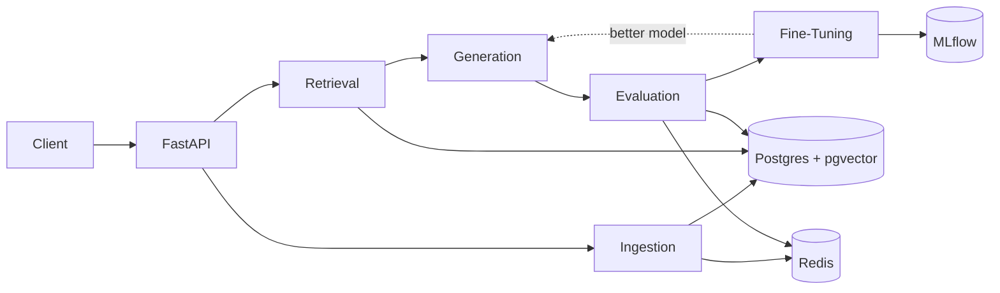
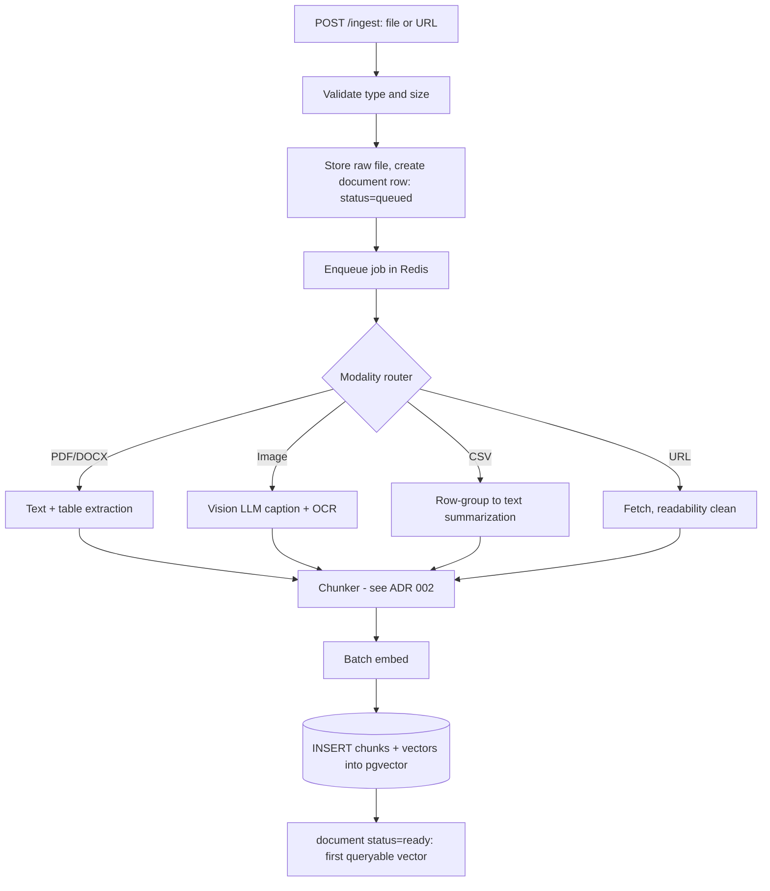
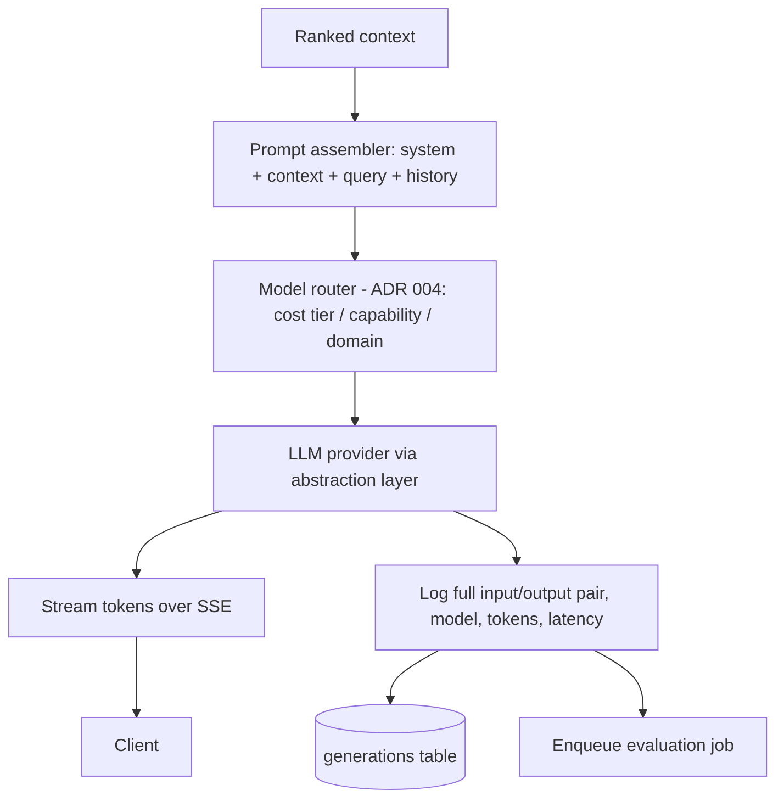
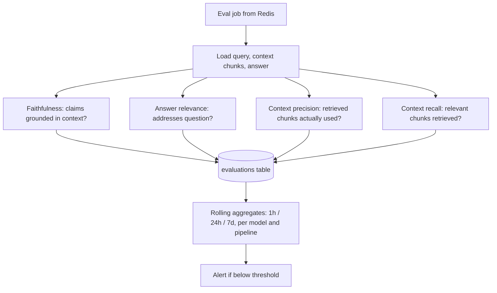
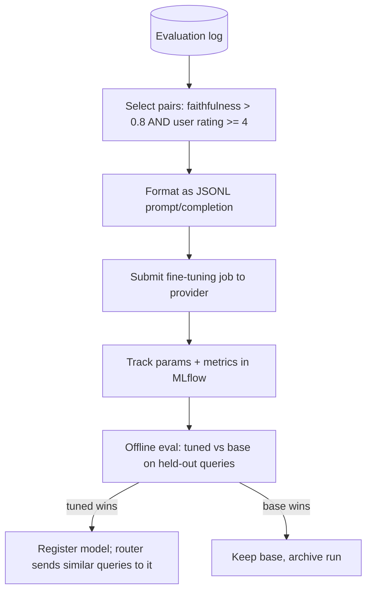

# NeuroFlow Architecture

NeuroFlow has five subsystems sharing one Postgres (+pgvector) database, a Redis queue/cache, and an MLflow tracking server.



## 1. Ingestion Subsystem
Accepts PDF, DOCX, images, CSV, and web URLs; extracts content per modality, chunks, embeds, and writes to the vector store.



Key points: idempotent via content hash; workers are async and horizontally scalable; failures retry 3x with backoff then go to a dead-letter list; chunk metadata (doc_id, page, modality, source, created_at) enables filtering.

## 2. Retrieval Subsystem
Runs three searches in parallel, fuses with Reciprocal Rank Fusion (RRF), reranks with a cross-encoder, and returns a ranked context window.

```mermaid
flowchart TD
  Q[User query] --> QE[Embed query]
  Q --> KW[Query normalization]
  QE --> V[Vector similarity - pgvector HNSW, top 50]
  KW --> K[Keyword search - Postgres tsvector BM25-like, top 50]
  Q --> M[Metadata filter - doc ids, modality, date]
  M --> V
  M --> K
  V --> R[Reciprocal Rank Fusion: score = sum 1/(60+rank)]
  K --> R
  R --> X[Cross-encoder reranker, top 50 to top 8]
  X --> W[Context window assembler: dedupe, token budget]
  W --> OUT[Ranked context + citations]
```

Latency budget: parallel retrieval < 150 ms, rerank < 200 ms. Results cached in Redis by (query hash, filters).

## 3. Generation Subsystem


Provider failures trigger fallback to the next model in the tier. The stream endpoint reconnects using `Last-Event-ID`.

## 4. Evaluation Subsystem
Asynchronously scores every generation using an LLM judge (see ADR 003).



## 5. Fine-Tuning Subsystem


Similarity routing: queries whose embedding is close to the fine-tuning cluster centroid (cosine > 0.8) go to the tuned model.

## Cross-cutting
- **Auth:** API keys (Bearer) with per-key rate limits.
- **Observability:** `/health`, `/metrics` (Prometheus), structured JSON logs with request IDs.
- **Storage:** Postgres (docs, chunks, vectors, generations, evaluations, jobs), Redis (queue, cache, rate limits), object/file store for raw uploads, MLflow for experiments.
